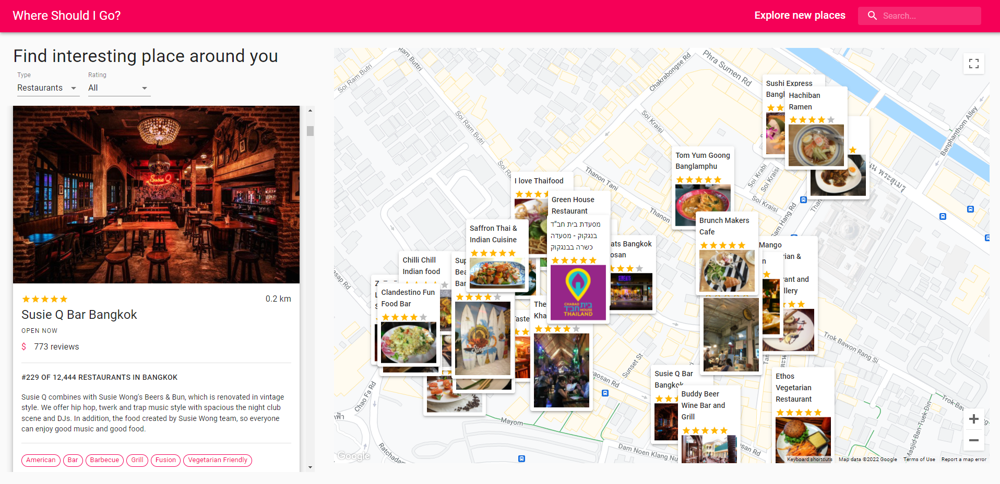

<!-- Add banner here -->

# Where Should I Go?

<!-- Describe your project in brief -->
Don't know where to go? 

Why not use this amazing app to find interesting places around your area on **google maps** with cool informations from **TripAdvisor**!

<!-- [where-should-i-go](https://thasup-travel-app.herokuapp.com/) -->

# Table of contents

-   [Where Should I Go](#where-should-i-go)
-   [Table of contents](#table-of-contents)
-   [Demo](#demo)
-   [Install](#install)
-   [Setup ENV](#setup-env)
-   [Highlight Technology](#highlight-technology)
<!-- -   [Features](#features) -->

# Demo

[(Back to top)](#table-of-contents)

[Where Should I Go?](https://thasup-suppee.herokuapp.com/)

<!-- # Features -->

<!-- [(Back to top)](#table-of-contents) -->

# Install

[(Back to top)](#table-of-contents)

1. clone this git on your computer
2. install [node.js](https://nodejs.org/en/)
3. run command `npm install` on terminal in this project directory
4. setup [.env](#setup-env) file
5. run command `npm start` on terminal
6. go to `http://localhost:3000/`

# Setup ENV

[(Back to top)](#table-of-contents)

**REACT_APP_GOOGLE_MAP_API_KEY** : [Google Maps API](https://developers.google.com/maps)

**REACT_APP_RAPID_API_TRAVEL_API_KEY** : [Travel Advisor](https://rapidapi.com/apidojo/api/travel-advisor/)

**REACT_APP_RAPID_API_WEATHER_API_KEY** : [Open Weather Map](https://rapidapi.com/community/api/open-weather-map/)

# Highlight Technology

[(Back to top)](#table-of-contents)

-   Google Maps API
-   MUI
-   React
