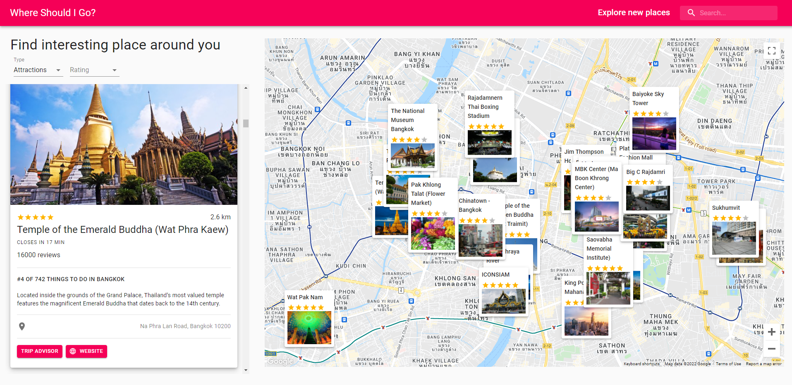

<!-- Add banner here -->

# Where Should I Go?

<!-- Describe your project in brief -->

Don't know where to go?

Why not use this amazing app to find interesting places around your area on **google maps** with cool informations from **TripAdvisor**!

# Table of contents

- [Where Should I Go](#where-should-i-go)
- [Table of contents](#table-of-contents)
- [Demo](#demo)
- [Features](#features)
- [Install](#install)
- [Setup ENV](#setup-env)
- [Highlight Technology](#highlight-technology)

# Demo

[(Back to top)](#table-of-contents)

[DEMO LINK](https://thasup-where-should-i-go.netlify.app/)

# Features

[(Back to top)](#table-of-contents)

- Find restaurants around your area
- Find hotels around your area
- Find attractions/landmarks around your area
- Find all of those anywhere in the world as you pan on google maps
- Filter information cards by rating
- See summary information on cards from Tripadvisor API

# Install

[(Back to top)](#table-of-contents)

1. clone this git on your computer
2. install [node.js](https://nodejs.org/en/)
3. run command `npm install` on terminal in this project directory
4. setup [.env](#setup-env) file
5. run command `npm start` on terminal
6. go to `http://localhost:3000/`

# Setup ENV

[(Back to top)](#table-of-contents)

**REACT_APP_GOOGLE_MAP_API_KEY** : [Google Maps API](https://developers.google.com/maps)

**REACT_APP_RAPID_API_TRAVEL_API_KEY** : [Travel Advisor](https://rapidapi.com/apidojo/api/travel-advisor/)

**REACT_APP_RAPID_API_WEATHER_API_KEY** : [Open Weather Map](https://rapidapi.com/community/api/open-weather-map/)

# Highlight Technology

[(Back to top)](#table-of-contents)

- Google Maps API
- MUI
- React
- API
